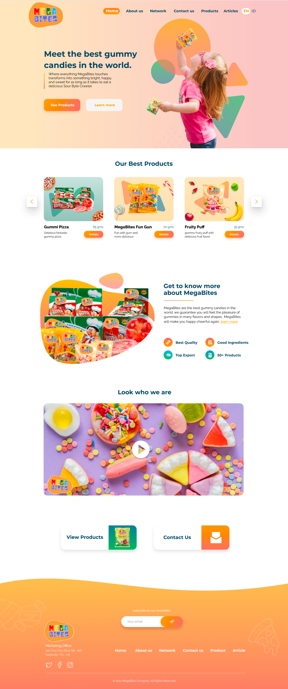

# MegaBites Webpage

MegaBites is a brand new fruity gummy. A graphic designer has been hard at work creating a homepage for the company. The CEO has approved the following design. Now it is time to code. Try your best to adhere to the design and create an HTML page (with a stylesheet) for MegaBites. 

* Mark-up the mockup with the overall structure. 
* Identify the HTML components.
* Create directory structure - use terminal.
* Create HTML structure using semantic tags.
* Add styling.
	1. Start with basics and solid blocks of color
	1. Use flexbox
	1. Enhance with styles and gradients

**Be sure to `add`, `commit`, and `push` to github often.**

## Resources
##### Graphics
* Refer to the `images` directory.

##### Website Copy
* Refer to the `website-copy.txt` file

#### Fonts - use Google Fonts
Headlines and Bold Text
* Font Family: Montserrat
* Color: #044560
* H1 size: 40px/2.5em
* H2 size: 32px/2em

Body Text
* Font Family: Raleway
* Color: #00000
* Size: 16px/1em

#### Color Palette
 * Orange/Logo Background Color: #FAA04C
 * Lite Pink: #F4C7C6
 * Tangerine: #F7886C
 * Yellow: #F9C060
 * Dark Blue: #044560
 * Lite Blue: #309DCB
 * Green: #33B984
 * Black: #000000
 * White: #FFFFFF

Gradients
* [CSS-Tricks: CSS Gradients](https://css-tricks.com/css3-gradients/)
* https://cssgradient.io/

Wave Generators
* https://www.softr.io/tools/svg-wave-generator
* https://getwaves.io/

#
>You may not get everything and that is OK! There are a few things that are really hard. Start with what you know and try your best and apply everything you have learned. Remember, there can be many solutions to the same problem.

## Stretch Goals
Only attempt these items once your code has been approved by an instruction team member.

1. Host the page with [Github pages](https://pages.github.com/)
1. Create and link to a `Products` page. Adhere to the design elements as much as possible. Be sure to wire-frame the products page before you write any code.
1. Create and link to a `Contact Us` page. Adhere to the design elements as much as possible. Be sure to wire-frame the page before you write any code.

##
This exercise utilizes the following concepts:

* Semantic HTML
* CSS
* Flexbox
* Git and Github
* Terminal
* Planning/Wire-framing
